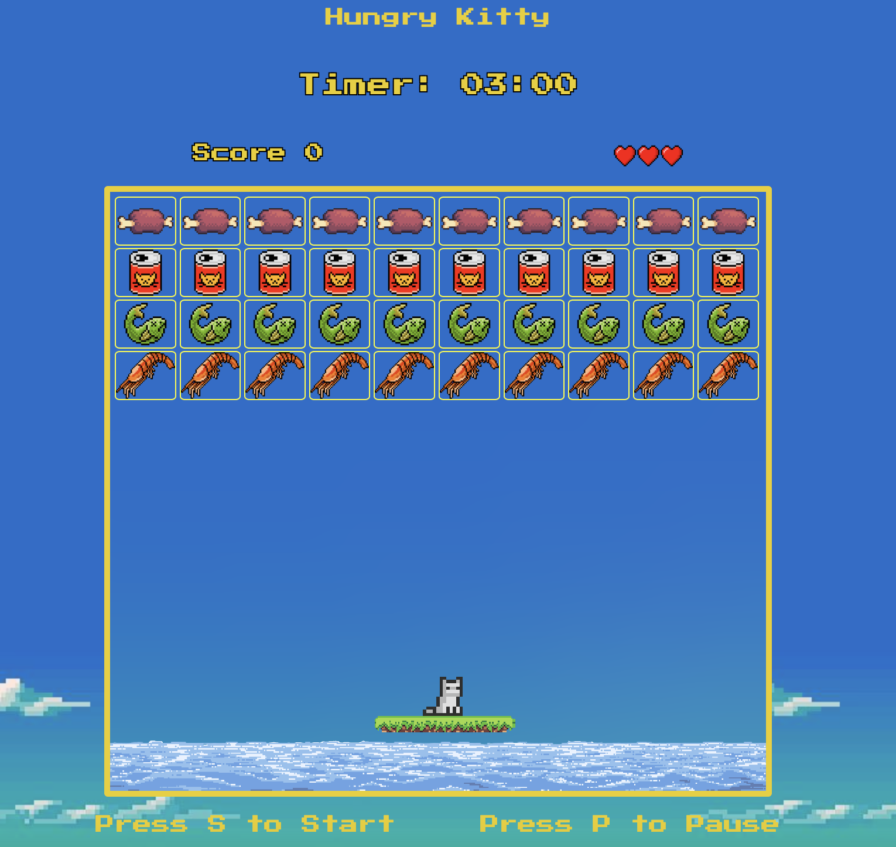
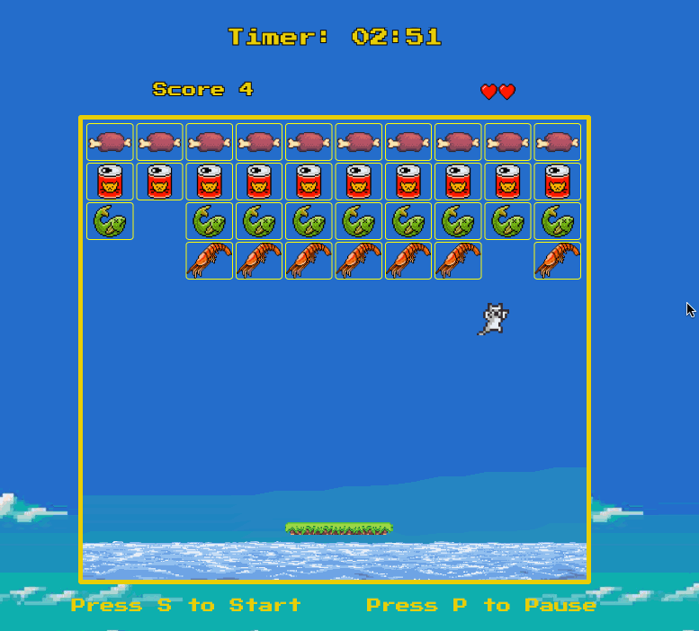

# JavaScript "Brick-Breaker" style game.

## Usage

### Host locally:

- After cloning the repository, run `cd cat-game` in your command line to change into working directory.
- Run command `open index.html` to run the program, and play the game!
   
   
- (Alternatively, you can use the Live Server extension in VS Code: https://marketplace.visualstudio.com/items?itemName=ritwickdey.LiveServer or access the game hosted on Github Pages via this link: https://rsmith-github.github.io/cat-game/)

 

 
 

## Gameplay

Once the you have opened the game with your preferred method, press <kbd>s</kbd> key to start the game. The cat will start bouncing in a random direction. It is your objective to help the Hungry Kitty eat all the food above it prevent the cat from touching the water. Rememeber, cats hate showers!

### To move the paddle:

To move the paddle, use <kbd>←</kbd> and <kbd>→</kbd> keys.

 

 
 

### To pause game:

- To **pause** and **unpause** the game, use the <kbd>p</kbd> key.

- Once paused, you can **restart** the game with the <kbd>r</kbd> key.
